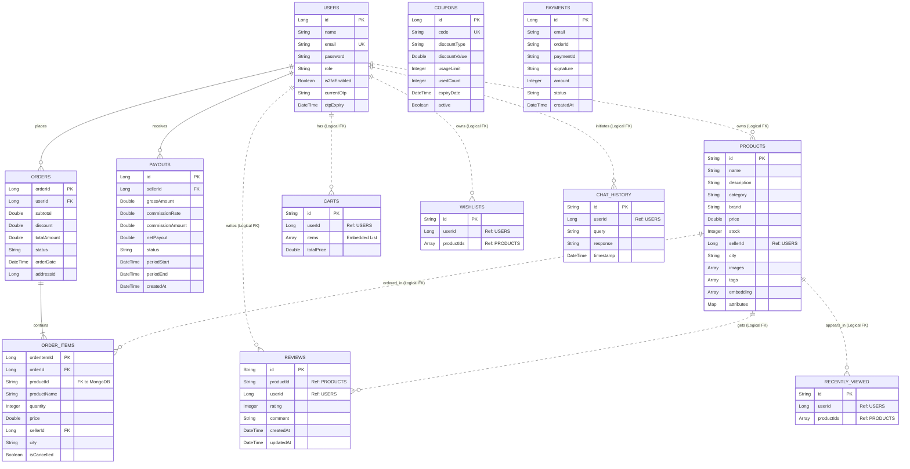

# System Architecture and Entity Relationship (ER) Design

This document details the system architecture and database designs of the microservices project. It includes interactive Mermaid diagrams mapping the infrastructure components, database relations, and logical cross-database mappings.

---

## 1. System Architecture Diagram

The project uses a standard Spring Cloud Microservices architecture with a React-based frontend. External client requests route through the Spring Cloud API Gateway, which utilizes Eureka Service Discovery to resolve service locations. Configurations are centralized in the Config Server.

```mermaid
graph TD
    classDef client fill:#E1F5FE,stroke:#03A9F4,stroke-width:2px;
    classDef gateway fill:#F3E5F5,stroke:#9C27B0,stroke-width:2px;
    classDef registry fill:#E8F5E9,stroke:#4CAF50,stroke-width:2px;
    classDef service fill:#FFFDE7,stroke:#FFEB3B,stroke-width:2px;
    classDef database fill:#FFE0B2,stroke:#FF9800,stroke-width:2px;
    classDef broker fill:#E0F7FA,stroke:#00BCD4,stroke-width:2px;
    classDef ai fill:#FCE4EC,stroke:#E91E63,stroke-width:2px;

    Client["Frontend (React / Vite)"]:::client
    Gateway["API Gateway (Spring Cloud Gateway)"]:::gateway
    Eureka["Eureka Registry"]:::registry
    ConfigServer["Config Server"]:::registry
    
    UserService["User Service"]:::service
    ProductService["Product Service"]:::service
    OrderService["Order Service"]:::service
    CartService["Cart Service"]:::service
    AIService["AI Service"]:::ai
    
    MySQL[("MySQL Database")]:::database
    MongoDB[("MongoDB Database")]:::database
    Ollama["Ollama AI (LLM)"]:::ai
    RabbitMQ["RabbitMQ Message Broker"]:::broker
    Zipkin["Zipkin Tracing"]:::broker

    %% Routing
    Client -->|HTTP 8000| Gateway
    Gateway --> UserService
    Gateway --> ProductService
    Gateway --> OrderService
    Gateway --> CartService
    Gateway --> AIService
    
    %% Registry & Config
    UserService -.->|Register/Discover| Eureka
    ProductService -.->|Register/Discover| Eureka
    OrderService -.->|Register/Discover| Eureka
    CartService -.->|Register/Discover| Eureka
    AIService -.->|Register/Discover| Eureka
    Gateway -.->|Discover| Eureka
    
    UserService -.->|Fetch Config| ConfigServer
    ProductService -.->|Fetch Config| ConfigServer
    OrderService -.->|Fetch Config| ConfigServer
    CartService -.->|Fetch Config| ConfigServer
    AIService -.->|Fetch Config| ConfigServer

    %% Storage connections
    UserService --> MySQL
    ProductService --> MySQL
    ProductService --> MongoDB
    OrderService --> MySQL
    OrderService --> MongoDB
    CartService --> MongoDB
    AIService --> MySQL
    AIService --> MongoDB
    
    %% AI Connection
    AIService --> Ollama
    
    %% Messaging & Tracing
    UserService <-->|Publish/Subscribe| RabbitMQ
    OrderService <-->|Publish/Subscribe| RabbitMQ
    
    UserService -.->|Traces| Zipkin
    ProductService -.->|Traces| Zipkin
    OrderService -.->|Traces| Zipkin
    CartService -.->|Traces| Zipkin
    AIService -.->|Traces| Zipkin
```

### Architectural Component Specifications:
*   **React Frontend** (Port `3000`): User interface built using React, Vite, and Tailwind CSS.
*   **API Gateway** (Port `8000`): Spring Cloud Gateway acting as the entry point. Handles routing, security filtering, and load balancing.
*   **Eureka Server** (Port `8761`): Service registry allowing microservices to discover one another dynamically without hardcoded URLs.
*   **Config Server** (Port `8888`): Spring Cloud Config Server managing external centralized properties from a configuration repository.
*   **RabbitMQ** (Port `5672` / `15672`): Message broker used for asynchronous event distribution between services (such as product stock updates, order confirmation notifications).
*   **Zipkin** (Port `9411`): Centralized latency measurement engine helping monitor distributed trace flows.

---

## 2. Entity Relationship (ER) Diagram

The system employs a **polyglot persistence** model:
1.  **MySQL** (Relational SQL): Used for transaction-heavy services demanding strong consistency, such as User Management, Orders, Coupons, and Payout computations.
2.  **MongoDB** (Document NoSQL): Used for flexible, fast read/write models, such as Catalog Products, Customer Reviews, Cart Items, Wishlists, and AI Chat Histories.

Mermaid ER relationships denote both **Physical Foreign Keys** (solid lines) and **Logical Cross-Database References** (dotted lines) managed through microservice API calls or event messages.

### Polyglot Relations Breakdowns:
*   **Physical Relationships (RDBMS)**:
    *   A `USER` can place multiple `ORDERS` (1:N).
    *   An `ORDER` contains one or more `ORDER_ITEMS` (1:N, mapped via cascade and orphan removal in MySQL).
    *   A seller `USER` can accumulate multiple `PAYOUTS` (1:N).
*   **Logical Relationships (Cross-Database/Service)**:
    *   `PRODUCTS` and `REVIEWS` inside MongoDB maintain references back to MySQL `USER.id` (`sellerId` and `userId` respectively).
    *   `ORDER_ITEMS` in MySQL references MongoDB `PRODUCTS.id` (`productId`).
    *   `CARTS`, `WISHLISTS`, and `CHAT_HISTORY` documents map logical relationships between `USER.id` and `PRODUCT.id` fields.
    *   `AI Service` reads product embeddings in MongoDB (`PRODUCTS.embedding`) and coordinates semantic search prompts via Ollama.
